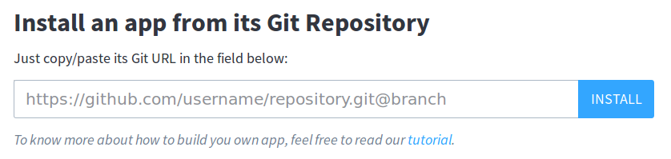

# Prerequisite

This part suppose you have installed the cozy development environment from the [cozy development introduction](/).

# Create a client-side application for Cozy

As a developer, do you believe it’s hard to play with data from differing applications? Well I'm here to try to prove you can and even more: you'll be able to code an application without a server, and this application will be able to use data from all the apps on your Cozy.

**Let's write a new contact application for Cozy !**

Now, let's get serious and straight to the point: our goal is to build a client-side app which lists all contact names from the `Contact` app. It will also allow users to create, update, and delete contact names.

To do so, we'll proceed in different steps. We'll start slowly by deploying a client-side "Hello World" app, and we'll finish with a full contact app using vanillaJS. This tutorial is for everybody, from padawan to jedi, so don't be scared of it. We'll explain everything.


# Make a client-side "Hello World Application"

## First step : Hello World !

Here we are, doing the traditional "Hello World" app that can make you want to start a new career.

```json
{
  "name": "your-app-name",
  "cozy-type": "static",
  "displayName": "Your App's Name",
  "version": "1.0.0",
  "description": "Your app's description",
  "icon-path": "main_icon.png"
}
```

Start by creating a folder `your app` and run a `git init` in it. Then you will need a few files : First, the manifest `package.json` as shown on the right. The fields you need are :

  - `name`, the name of your app (without space)
  - `cozy-type: "static"`, which tells Cozy your app doesn't need a server
  - `displayName`, the user readable name
  - `version`, to manage application's updates
  - `description`, what the user will see when installing your app
  - `icon-path`, a path to your app icon


```html
<!doctype html>
<html lang="en">
<head>
  <meta charset="utf-8">
  <title>Your app !</title>
</head>
<body>
  <p>Hello World !<p>
</body>
</html>
```
Also, an `index.html` file needs to be at the root of your repository with your 'Hello World' written in it.

Once you have these, publish your app on [github](https://github.com/) and you should be able to install it from the "store" page on your cozy. If you managed to deploy it, congratulations!



Your app could be broken if the controller didn’t manage to do one of the following operations: clone it, install it or launch it. If your application has a `package.json` that has some syntax error for example, or your file that launches the app hasn't been found, your application will not work.

If not, don't worry, we're here to help you: the most easy way to contact us is by joining our [irc channel](http://irc.lc/freenode/cozycloud) (#cozycloud on Freenode server).

## Source code

At the end of this step, your app should be similar to [this](https://github.com/cozy/cozysdk-client-tuto/tree/v1.0).

## Framework decision time

From this point, you will want to add some javascript and start working with the user data. You can get started easily using only some DOM manipulation, but if you want to make a more complicated app, you are going to need a Frame work.

If you don't have a framework preference, we recommend you get started using the [Vanilla JS](#option-1-vanilla-js) section and [Sample app](https://github.com/lemelon/cozysdk-client-tuto/tree/vanillajs). The term vanilla JS is a joke about using "pure" javascript without any library. It's better to start this way and then pick the framework which best scratch your itches.

If your framework of choice is Angular.js, you just got lucky as we have a [section](#option-2-angular) and [Sample app](https://github.com/lemelon/cozysdk-client-tuto/tree/angularjs) for it. If you prefer another framework, you will find the information you need in the Vanilla section, but let us know and we might include it here !


# Option 1 - Vanilla JS


## Source code

To see the fully working and finished version, you can go on this [github]() repo.

## Second step: Get contacts


```html
<script src="./cozysdk-client.js" />
```
First of all, please add [cozysdk-client.js](https://github.com/cozy/cozysdk-client/blob/master/dist/cozysdk-client.js) in your repository and link it into your html page.

```javascript
function updateContactList(){
   // let's code here
}

document.addEventListener("DOMContentLoaded", updateContactList);
```

Then we want to start doing things once our app, is loaded, nothing easier, we can add an [event listner](https://developer.mozilla.org/fr/docs/Web/API/EventTarget/addEventListener) to the browser event `DOMContentLoaded`.

We can now start doing some coding in out function `updateContactList`. Our objectives here are simple: getting the list of contacts from your `contact` app, only with javascript. The goal is to show you how simple it is to send requests to cozy-data-system, without worrying about which framework to chose.

```javascript
function updateContactList(){
  cozysdk.defineRequest('Contact', 'all', 'function(doc) { emit(doc.n); }', function(err, res) {
    if (err != null) return alert(err);
    cozysdk.run('Contact', 'all', {}, function(err, res) {
      if (err != null) return alert(err);
      var contacts = JSON.parse("" + res);
      /* contacts == [
        {id:"323274828329", key:"Jane;Willson"},
        {id:"323274827428", key:"John;Smith"}
      ]*/
      render(contacts);
    });
  });
}
```
<!-- @TODO explications about contact & requests-->
So what we want to do here is getting all contacts and display them into an html array. To do so, we will use the [cozysdk](https://github.com/cozy/cozysdk-client/blob/master/api.md), and more acurately its functions [define request](https://github.com/cozy/cozysdk-client/blob/master/api.md#definerequestdoctype-name-request-callback) and a [run request](https://github.com/cozy/cozysdk-client/blob/master/api.md#rundoctype-name-params-callback). Nothing more.


```javascript
function render(contacts){
  var HTML = ''
  for (var i = 0; i < contacts.length; i++) {
    HTML += '<tr data-id="' + contacts[i].id + '">' +
          +   '<td><label>' + contacts[i].key + '</label></td>'
          + '</tr>';
  }
  document.querySelector('.contact-list').innerHTML = HTML;
}
```

For simplicity, we re-render the whole array every time it changes. So we create a string of HTML with rows and cells and use [innerHTML](https://developer.mozilla.org/fr/docs/Web/API/Element/innertHTML) to display it in our application.

<aside class="notice">
This example works better if you do have some contacts in your Cozy database. If you haven't done so already, install the Cozy Contacts application from the store on your Cozy and enter some contacts. You can import some contacts from google or insert new contacts manually.
</aside>

### Source code

You can find the source code for this step [here](https://github.com/lemelon/cozysdk-client-tuto/tree/step1-vanilla).

## Third step: Create, destroy or update a contact

So, displaying the contacts from the cozy is cool, but can our app change them ? Yes We Can !

[Follow along on github](https://github.com/cozy/cozysdk-client-tuto/tree/step2-vanilla/)

### Contact creation

```html
<input class="send" placeholder="Add a new contact">
```
```javascript
document.querySelector('.send').addEventListener('change', onSendChanged);
```

So we add a field to our html page and an event handler, when the user
write something in the field, the function `onSendChanged` is called and we are going to create a contact with this name.

```javascript
function onSendChanged(){
  var contactName = document.querySelector('.send').value.trim();
  var values = {n: contactName};
  cozysdk.create('Contact', values, function(err, res) {
    if (err != null) return alert(err);
    // res.id == "8239283928326"
    document.querySelector('.send').value = '';
    updateContactList();
  });
}
```

For that, we are getting the value from the field and passing it to the cozy SDK's `create` function, along with the type of document we want to create.

When the contact has been created, the callback function is called and we can get the contact id. At this point, we could try to be smart and inject a row into the table, or we could go the easy way and just update the whole list again.

### Contact update & delete

First things first, let's add some columns and controls to our render function. You can see it done [here](https://github.com/cozy/cozysdk-client-tuto/blob/4ce72ad6d387347914e20bd72212b32ba70ed1bf/app.js#L95-L107)

To capture the user interaction with these buttons, we are going to use something called event bubling. It means we can add event listeners to the whole table and check the event to see if they match our criteria. This is done in the [attachEventHandler](https://github.com/cozy/cozysdk-client-tuto/blob/4ce72ad6d387347914e20bd72212b32ba70ed1bf/app.js#L59-L66) function.

So now, when the user change the value of our name fields, the `onUpdatePressed` function is called. However we still need to retrieve the id of the contact.
For this, we use the [getIDFromElement](https://github.com/cozy/cozysdk-client-tuto/blob/4ce72ad6d387347914e20bd72212b32ba70ed1bf/app.js#L68-L73), the way to do it is a recursive function: the function will not stop going back to itself until it finds a tag with  `data-id`.

So we first check the `<input>`, no `data-id`, we go up, the `<td>`, still nope, then the `<tr data-id="id of the modified contact">` and we got it !

For update, we pass the id and the change we want to make to the [cozysdk.updateAttributes](https://github.com/cozy/cozysdk-client/blob/master/api.md#updateattributesdoctype-id-attributes-callback).

For delete, we pass the id to [cozysdk.destroy](https://github.com/cozy/cozysdk-client/blob/master/api.md#updateattributesdoctype-id-attributes-callback)

In both case we callback is called when the action is finished and we can update the list again !

## Going further

I think my role is complete. You now have the technical tool to develop client-side apps on Cozy. If you want to use a framework, you can experiment with using it and the cozysdk and let us know how it goes.

The challenge now will be to understand and meet the needs of a random Cozy user. What new service can you offer this user, in order to simplify the managing of his or her data? You now know how to synchronise data from the different applications, so you'll need to go further and imagine what you can do with this knowledge.

When your application is going to be able to change the life of all the Cozy users, you can add it on [cozy-registry](https://github.com/cozy/cozy-registry) by making a pull request.


# Option 2 - Angular

## Second step: Add AngularJS

### Our objectives for this step

Making an application in javascript can get complicated fast. Before we try going further, lets pick a framework and use it to display our "Hello World!" example. For this tutorial, we've chosen angularJS.

AngularJS is a Single Page Application (SPA) framework. If you don't have an idea of what I'm talking about, I invite you to follow the official AngularJS [tutorial](https://angularjs.org/): it explains exactly what AngularJS is and why it's advantageous for the user.

AngularJS enables the user to easily create dynamic views. It's a very used SPA, so that's why it could be a beneficial learning tool.

To get started with angular, we will need to include the angularJS library in our app and declare an entry to our application, by calling `ng-app="[the name of your app]"`. We'll also need to have a main module and setup the relation between the view (home.html) and the controller (Home.Ctrl.js). If you want some style-guides for proper angular structure and coding, we recommend the [Johnpapa's angular styleguide](https://github.com/johnpapa/angular-styleguide)

### The skeleton

- `controllers/`, [Here](https://docs.angularjs.org/guide/controller) you have a guide about how controllers work
- `partials/`, All the html (view) files. Templates rendered by ng-view
- `vendor/`, The different modules (library) needed for angularjs
- `app.module.js`, Main module (route configuration, angular lib importations...)

If you understand the skeleton and the main logic of this code, you basically understood what angularjs is all about.

### Source code

You can find the source code for this step [here](https://github.com/lemelon/cozysdk-client-tuto/tree/v2.0)!

## Third step: Get data from contacts app

Now down to some serious business: we're ready to play with different Cozy applications. We decided to interact with the "Contact" app but you can also do the same for any other application. Imagine what service you can propose to your future users. But for now, let's synchronize with contacts by getting all the names of the user contacts...

### Install the contact app from the store and create or import a few of your contacts

To understand what we are doing here, you will need to have some contacts in your Cozy database. If you haven't done so already, install the Cozy Contacts application from the store on your Cozy and enter some contacts. You can import some contacts from google or insert new contacts manually.

#### Our objectives for this step

For this step, we'll have to get the list of all the names of the contact app. First of all, we'll need to create permissions in the 'package.json' file to be able to access the data of the `Contact` app.

You'll also need to import two files into your project:

- [cozysdk-client.js](https://github.com/cozy/cozysdk-client/blob/master/dist/cozysdk-client.js): this is a javascript Cozy library that enables to do clean request to the data-system. You can access this [tutorial](https://github.com/cozy/cozysdk-client/blob/master/api.md) to learn how to use it.
- [cozysdk.angular.js](https://github.com/lemelon/cozysdk-client-tuto/blob/master/interfaces/cozysdk.angular.js): this is the Cozy file that enables you to connect the logic of the cozysdk-client library with angularjs. It helps developers to work with organized code in angularjs.

Both these files are optional, you could use `postMessage` to retrieve your app token and then do manual `XMLHttpRequest` calls against the [data-system api](https://docs.cozy.io/en/hack/cookbooks/data-system.html), but as the saying goes: ["do not reinvent the wheel"](https://en.wikipedia.org/wiki/Reinventing_the_wheel). So why do complicated when you can do simple?

We'll also need to add, in your Home.Ctrl.js file, a call to [defineRequest](https://github.com/cozy/cozysdk-client/blob/master/api.md#definerequestdoctype-name-request) and [run](https://github.com/cozy/cozysdk-client/blob/master/api.md#rundoctype-name-params-callback) it to get all Contacts.

We chain and get the results of these calls through promises. If you're not familiar with this syntax, you can read more about it in [this article](http://www.webdeveasy.com/javascript-promises-and-angularjs-q-service/). Once we have the result, we can add it to our scope and display them in `home.html` by using a `ng-repeat`.

We can also put a filter to show how simple it is to do it in angularjs, just for the fun.

### Source code

You can find the source code for this step [here](https://github.com/lemelon/cozysdk-client-tuto/tree/v3.0)!

### So what happened?

This is exactly where the magic is: two apps that have nothing to do with each other, developed by two different people that might not even know each other, can work together and be synchronized, or, even better, rationalized. In other words, this demo proves the fact that the apps can talk to each other. So to think a bit further, the apps can share their data to be able to give transverse services. So because our applications work in the same data space, the apps start to collaborate to deliver a more integrated user experience. They are, in a certain way, smart.

## Fourth step : Create, destroy or update a contact

Ok, now we're going to have some real fun, since our framework is understood and well implemented.

#### Our objectives for this step

The only thing we'll have to do here is to add some functions in the controller. Nothing more. The other nice thing that you'll be able to notice, is that every changes is going to refresh in the contact app instantly, even without page reloading.

The functions that we'll need are `send`, `update`, and `destroy`. These function respectively enables to call [`create`](https://github.com/cozy/cozysdk-client/blob/master/api.md#createdoctype-attributes-callback), [`updateAttributes`](https://github.com/cozy/cozysdk-client/blob/master/api.md#updateattributesdoctype-id-attributes) and [`destroy`](https://github.com/cozy/cozysdk-client/blob/master/api.md#destroyid-callback) from the 'cozysdk.angular.js' file.

#### Source code

You can find the source code for this step [here](https://github.com/cozy/cozysdk-client-tuto/tree/v4.0)!

#### What to keep in mind?

So I've added four functions to the controller file : send, update, destroy, and updateContactList.

### Going further

I think my role is complete. You now have the technical tool to develop client-side apps with angularjs on Cozy. You can also acquire more skills on angularjs by googling it and seeing the enormous amount of tutorials on it. The challenge now will be to understand and meet the needs of a random Cozy user. What new service can you offer this user, in order to simplify the managing of his or her data? You now know how to synchronize data from the different applications, so you'll need to go further and imagine what you can do with this knowledge.

When your application is going to be able to change the life of all the Cozy users, you can add it on [cozy-registry](https://github.com/cozy/cozy-registry) by making a pull request.
