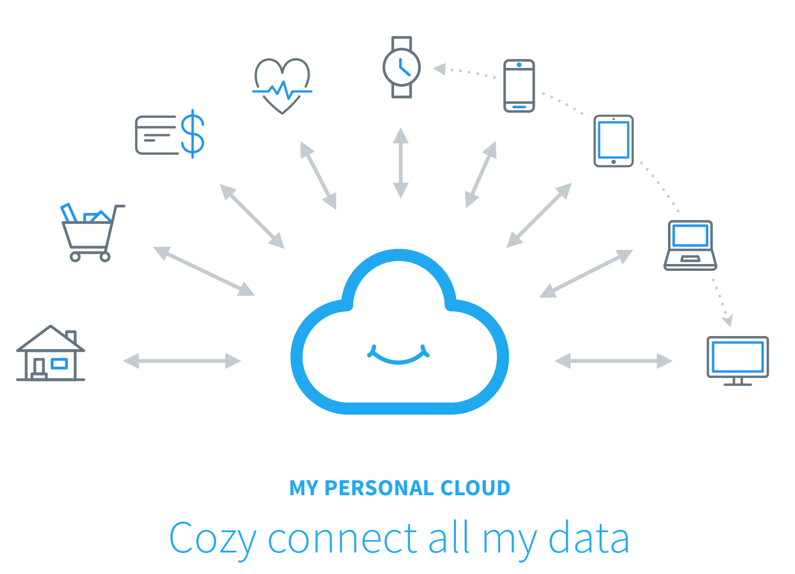

# Introduction

<aside class="notice">
Do not hesitate to <a href="https://github.com/cozy-labs/cozy-dev-docs/tree/master/source/index.md" target="_blank">edit this page</a> if you want to improve it.
</aside>

Welcome to the **Cozy Developer Space**.

<p style="text-align: center"></p>

Here you’ll find everything you need to understand Cozy technically and to develop applications and konnectors.

The **technical level required** to read and understand this documentation is not over 9,000; you’ll roughly have to:

 * Understand how the web works (both **client** and **server** side)
 * Read/Write **JavaScript**, **HTML** and **CSS**
 * Install and run a **Node.js** process
 * Be comfortable with **command-line** calls
 * Know that cookie are not made of flour

 > Code examples are available in **both JavaScript and CoffeeScript** for <s>every troll's taste</s> everyone's preference.

```javascript
console.log(" ╰(◕‿◕)╯ ");
```
```coffeescript
console.log " ╰(◕‿◕)╯ "
```

<p style="text-align: center"></p>


## Why & How we made Cozy


Cozy is a **personal web deployment platform**, which enables you to quickly bootstrap applications and interact with your data. It stands on a server - between your application and the operating system - easying the pain of **system administration**, **web development** and **security**.

### Data-oriented (WIP)

The initial idea was to create a space where developers can **experiment and play with their data**, while remaining in control of the platform. A friendly centralized point to fetch data from Things-Of-Internet, devices and personal services.

<p style="text-align: center"></p>

More than a simple Platform-as-a-Service, Cozy puts the cloud back where it belongs: at home.

Find out more on the [Architecture section](#architecture-amp-components)


### Tools

Cozy also became our **daily working environment**, and we want it to be as comfortable as possible. It means that we require it flexible, extensible and usable. We use **Node.js** and **CouchDB** as our main technologies.

<p style="text-align: center">
  <a href="https://nodejs.org" target="_blank"></a>
</p>


**Node.js** is a great and modern engine with a huge community of module creators. It has elvoved along with the GitHub's Open-Source popularization and is now wide-spread in the Web industry. Aside from being heavily maintained, it remains fun to extend and play with.

<p style="text-align: center">
  <a href="https://couchdb.apache.org" target="_blank"></a>
</p>

**CouchDB** is surely less-known, but definetly reliable. As a proper Erlang program, it has proven its strength and stability. A consistent, well-documented API, plus wonderful replication capabilities: the recipe of what we love on a database engine.


## Developing with Cozy


“ *Cozy has been a great opportunity for me to start coding. Now I run a decent business.* ”
<small>Bill Getas - Startup entrepreneur</small>

“ *Thanks to Cozy, I successfully managed to build a working web application without a hassle.* ”
<small>Tim Bernee-Lers - enthusiast web developer</small>

“ *I'm sorry Dave, I'm afraid I can't do that.* ”
<small>HAL 9000 - CoffeeScript compiler</small>

<p style="border-bottom: 1px solid #ccc;"></p>

But to be honest, we don't need those fancy words to convince you to develop on Cozy.


### To the future, Marty!

Cozy is a **modern web platform** that abstracts a lot of complexity out of personal **data manipulation**. If you are planning on developing a tool to **fetch**, **visualize** or **mix data**, a Cozy Application or a Konnector may be a good way to start.

By developing on Cozy, you will:

 * Reach a community of **enthusiast testers** and end-users
 * Learn how to make **single-page applications** with modern JavaScript frameworks like **Angular.js** or **React.js**
 * Be guided by [Cozy mentors](#mentorship), JavaScript gurus and other contributors
 * Enjoy the **built-in security** of Cozy

And whatever the reason, you will always find a friendly team member to help you dealing with your struggles and questions on the [IRC channel](#irc).

**So let's dive into it**!


# Getting Started

This section is a quick tutorial showing off the different steps to start using Cozy as a development environment, making a simple app, and interact with your data.

## Set up the Development Environment

Since Cozy is made from several pieces, we wrapped it into an **easy-to-use Virtual Machine**, so you don't clutter your local system. That also means you can use the operation system you like! Well, there are obviously issues on Windows, so we will assume here that you use a **GNU/Linux system or Mac OS X**.

The environment is made of two parts: the Virtual Machine itself - a fully installed Cozy platform - and a local Node.js tool called `cozy-dev` which will help you getting started and deploying your app to your Cozy.

### 1. Install Git

 > On GNU/Linux, just install Git with your package manager

```shell
apt-get install git
```

 > On Mac OS, download the software here: <br>
 > <a href="http://git-scm.com/download/mac">http://git-scm.com/download/mac</a>

```shell
# To check if Git is installed
git --version
```

The first step is obviously to install the development dependencies. Git is the [SCM](https://en.wikipedia.org/wiki/Version_control) we use at Cozy, and if you don't know how to use it yet, don't worry: we will give example commands in the following tutorial.


### 2. Install Node.js 0.10.x

 > On Debian GNU/Linux Jessie, the proper version of Node.js is available in the official repositories

```shell
apt-get install nodejs nodejs-legacy
```

 > On other GNU/Linux systems, you can install Node.js manually by doing

```shell
wget -q -O - http://nodejs.org/dist/v0.10.40/node-v0.10.40.tar.gz | tar xz
cd node-v0.10.40
./configure
make
make install
cd .. && rm -r node-v0.10.40
npm install -g npm
```

 > On Mac OS X, simply download the package, and install it <br>
 > <a href="https://nodejs.org/dist/v0.10.40/node-v0.10.40.pkg">https://nodejs.org/dist/v0.10.40/node-v0.10.40.pkg</a>

```shell
# To check the Node.js version
node --version
```

Installing Node.js on your local environment is necessary to run your app and use `cozy-dev`. Cozy runs well on <strong>Node.js v0.10.40</strong>, and you will have to install this version.

You can find detailed instructions of installation on the [official page](https://github.com/nodejs/node-v0.x-archive/wiki/Installing-Node.js-via-package-manager).

<aside class="warning">
If you already have a Node.js version installed on your computer that is not <strong>v0.10.40</strong>, you will have to consider <strong>upgrading/downgrading</strong> it, or to use a tool like <a href="https://github.com/tj/n">N</a>.
</aside>


### 3. Install VirtualBox and Vagrant

**VirtualBox** is used to emulate a full Operating System in a Virtual Machine. You can download it from [https://www.virtualbox.org/wiki/Downloads](https://www.virtualbox.org/wiki/Downloads)

**Vagrant** is a Command-Line Interface to interact with VirtualBox and handle development environment easily. You can download it from [https://www.vagrantup.com/downloads.html](https://www.vagrantup.com/downloads.html)

<aside class="notice">
On Debian GNU/Linux 8, <code>virtualbox</code> and <code>vagrant</code> are available in the official repositories.
</aside>


### 4. Install <code>cozy-dev</code>

```shell
# Use the -g option to install system-wide
sudo npm install -g cozy-dev
```

As mentionned above, `cozy-dev` is a set of tools aiming to help you managing your app deployment and your development environment. It is recommended to install it system-wide.

The full documentation of `cozy-dev` can be found below on the [related section](#cozy-development-environment).


### 5. Download and start the environment

```shell
# Create a development directory
mkdir cozy && cd cozy

# Download the environment
cozy-dev vm:init

# Start the environment
cozy-dev vm:start

# Check that the environment is properly started
cozy-dev vm:status

# Update the environment (strongly recommended)
cozy-dev vm:update
```

Use `cozy-dev` to initialize the environment.
It is recommended to **update it** at the end because we don't necessarily maintain the raw image in an up-to-date state, as a new version of Cozy can be released every couple of weeks ☺

<aside class="notice">
The command <code>cozy-dev vm:init</code> can take a few minutes to complete as it downloads the full environment. You only have to do it once though.
</aside>

<aside style="clear: both" class="success">
You should now be able to go to <a href="http://localhost:9104">http://localhost:9104</a>! ☺
</aside>

## Introduction to Cozy Cloud architecture
Before writing code, let's have an overview of the Cozy Cloud architecture. The platform is made of 3 main components:

* the proxy handles user authentication. Your app won't have to deal with it, nor anything user related, because Cozy has a single user.
* the data system is a wrapper for CouchDB, which handles authorization and permission of applications when they access data.
* the pPaaS is what install, updated, uninstall, start and stop applications in the platform. You don't have to tink about deployment!

The Cozy Cloud architecture is detailed in a [specific part]().


Let's write our first Node.js application for Cozy. We'll learn step by step how to organize our code, interact with the database, and package the application to deploy it into a Cozy instance.


## Hello World! Architecture of a Node.js Cozy application.
In order to facilitate our discovery, we're going to use a premade template that we will improve step by step with features offered by Cozy.
We are going to write a REST API using Express.js and module to interact with Cozy data system seamlessly, cozydb.

It would be no fun to do without a purpose, so we'll use the context of an application that keep track of debts we owe friends.

Start by getting the repo and install the dependencies:

```shell
git clone https://github.com/jsilvestre/cozy-tutorial.git cozy-hello-world
cd cozy-hello-world
npm install
npm run dev # this command will start everything you need to start writing code.
```

<br style="clear: both;" />
We can now introduce the application files structure.

* client/
* node_modules/
* server/
  * controllers/
      * index.js
      * debt.js
  * models/
      * debt.js
      * requests.js
* server.js
* package.json

### The controllers
The `server/` folder is where we'll spend most of our time. Firstly, we'll focus on the `controllers/` folder. A controller is a set of handlers attached to a route. When a request matches a route, the handler is executed. Look at this example:

```javascript
// ./server/controllers/index.js
var express = require('express');
var router = express.Router();

// Hello world!
router.get('/hello-world', function(req, res, next) {
    res.status(200).send('Hello, Cozy World!');
});

// Export the router instance to make it available from other files.
module.exports = router;
```

This will execute the callback when you request http://localhost:9250/hello-world with your browser. Try it now!


We can also check the official [Express.js documentation about routing](http://expressjs.com/en/guide/routing.html) if we want to learn more about it, or keep it as a reference for future use.

We've prepared an empty controller (`./server/controllers/debt.js/`), but we'll deal with it in the next part.

### The entry point: server.js
You may wonder how to glue everything together. All that magic is done in `server.js`. The code itself is straightforward, and we shall have to change it in the future.

```javascript
// ./server.js
var express = require('express');
var app = express();

/*
    Configuration section.
*/
// Nothing for now


/*
    Define routes and their handler.
*/
var indexController = require('./server/controllers/index');
app.use(indexController);


/*
    Start the HTTP server.
*/
var server = app.listen(9250, function () {
  var host = server.address().address;
  var port = server.address().port;

  console.log('Cozy tutorial app listening at http://%s:%s', host, port);
});
```


### Other elements
The `client/` folder will be untouched in this tutorial, which focused more on the Cozy specificties that are located on the server. It is important to note that we can use any technology we like, Angular, React, Ember, Backbone, jQuery, even your own framework. For the needs of this tutorial, the client will be a simple HTTP client to see the result of our work on the server.

The `node_modules/` folder contains the dependencies installed earlier, you will never touch it either.

`package.json` is the application's manifest. It is needed to keep the dependencies the application needs, but can be extended with cozy-specific information. The packaging and deployment process is described later in this tutorial.

<br />
<br />
We've covered the basic structure of a Node.js application using Express, but we haven't tackled any Cozy specifities yet. Let's build our first CRUD using Cozy's data system!


## Interacting with the Data System: basics


### The Data System
The Data System is the data layer of Cozy Cloud. Technically, it is a wrapper for CouchDB that manages authorization and authentification of applications willing to access user's data. CouchDB is an open-source NoSQL database document-oriented. If you are familiar with SQL database such as MySQL, you will find it different in various ways:

* there is no concept of "table"
* the database is one huge list of typeless JSON documents

The Data System introduces the concept of document type. Each document has a **document type**. Each application can **declare or reuse** document types. It can be Contact, an Event, a File, a Message, a Todo, etc.
It's a coherent data assembly that we define the schema (or use the one defined by others). There are many existing document types, we've documented the main ones [here]().
The document type is automatically stored in the CouchDB document by the Data System. From our developper point of view, it's as if we were using SQL tables.

The Data System offers a REST API, which means one must use HTTP requests to communicate with it. In order to facilitate this communication, we've built a module to provide developers a programatic API: please, meet `cozydb`.

<aside class="notice">
The Data system can do much more, we'll introduce you its features step by step.
<br />
If you are willing to check the full Data System's documentation, please [click here]().
</aside>

### Using cozydb to build a CRUD
In this section, we will learn how to define a new document type in our application, and build a CRUD, a set of basic operations: Create, Read, Update, Delete) for it.

In order to try our results, we'll to wrap this CRUD with an HTTP API in our Hello World application. This API is already defined in `./server/controllers/debts`, but it's an empty shell that we'll fill.

As stated earlier, we are going to write a CRUD for debt management application.

#### Define the document type
Firstly, we must define the document type that represents a debt. We recommend to put it into a separate file. The skeleton has been created for us: `./server/models/debt.js`.

The document type definition consists in a schema that you can define that way:

```javascript
// ./server/models/debt.js

// Definition of the document type and basic operations on debts.
var cozydb = require('cozydb');

// Make this model available from other files.
var Debt = cozydb.getModel('Debt', {
    /*
        The description is the subject of debt, why do we contract the debt in
        the first place.
    */
    'description': {
        default: '',
        type: String
    },

    /*
        The amount is how much do we owe.
    */
    'amount': {
        default: 0.0,
        type: Number
    },

    /*
        The due date is an optional field to allow to set a due date.
    */
    'dueDate': {
        default: null,
        type: Date
    },

    /*
        The creditor represents who we owe.
    */
    'creditor': {
        default: '',
        type: String
    },
});

module.exports = Debt;

```

`cozydb.getModel` returns an object we call a model that can perform operations on the Data System with the knowledge of the document type. A model has several methods that will help us achieve our goals. Let's discover them by writing the controller's code.


#### Create a new debt
The code to create a new debt document is straightforward when we already know Express, but we'll explain a bit more so all of us can follow.

Let's go to http://localhost:9250/. As you can see, a small tool to interact with our API has been prepared in order to help us understand what is going on.
On the left, we can see the form we can fill to create a debt, on the right is the raw payload that will be sent along the request, as the request's body.

Play with it and look at the result. You will see an error. Let's have a look at the controller's code in `./server/controllers/debt.js` to understand why.

The code says that on an HTTP POST request with the URL `/debts`, the handler is executed, but the handler doesn't do anything.

We can fix it by using a function from the model we've defined.

```javascript
// ./server/controllers/debt.js

// Create a new debt
router.post('/debts', function(req, res, next) {
    /*
        `Debt.create` will send a request to the Data System in order to create
        a new document of type "Debt".

        `req.body` is the request's body, it is here assumed that it exists and
        is a valid JavaScript object, matching the schema defined in the model.
    */
    Debt.create(req.body, function(err, debt) {
        if(err) {
            /*
                If an unexpected error occurs, forward it to Express error
                middleware which will send the error properly formatted.
            */
            next(err);
        } else {
            /*
                If everything went well, send the newly created debt with the
                correct HTTP status.
            */
            res.status(201).send(debt);
        }
    });
});
```
<br style="clear:both;" />
The function `Debt.create` creates a new debt object with the data from the request's body. That means the client must send a body with all the mandatory fields you defined in the document type schema. `req.body` contains exactly the payload you declared in the client.

It is important to note that `req.body` only exist because we use the `body-parser` middleware, declared in `./server.js`. This middleware looks into every requests the server receives, and if it find a JSON payload, unserialize it to a JavaScript object.

<aside class="notice">
As an eye-sharped reader, you probably noticed we don't do data validation at all here. For security reasons, and to prevent users from messing up, it is strongly advised to validate all data before pushing them to the database.
</aside>

We use Express' default error middleware to process eventual errors that could occur. To achieve that, we call the `next` function with the error as parameter. If an error occurs, Express will send the error in the response's body, with an status code of 500. If you want to learn more about Express middlewares, you can check the official [documentation page](http://expressjs.com/en/guide/using-middleware.html).

When we try again to create a new debt from the browser, we can notice the result is not just the payload we send, but the document from the database itself. Most importantly, it has an "_id" field, which is a unique identifier for the document, that we can reuse for later access, update, or deletion. For the purpose of this tutorial, let's keep the ID of the document we've created.

<aside class="notice">
We also notice there is a identical "id" field. We should not pay attention to it, as it is deprecated, and will be removed in the near future.
</aside>

#### Fetch an existing debt
Now we've learned how creating a new debt, we may want to fetch it. Fetching is done thanks the ID of the document, which is its unique identifier in the database.

We can go back to our application, and try to fetch the document we've created with the ID we wrote in the previous part. Once again, it won't work because there is no code in the controller.

Another method of the model object is `Debt.find`, which allows us to fetch one document from the database, given its ID.

The document's ID is given in the URL, which Express conveniently build into the
`req.params` object. In this case, if the defined URL pattern were `/debts/:toto`, the data would be found in `req.params.toto`.

```javascript
// ./server/controllers/debt.js

// Fetch an existing debt
router.get('/debts/:id', function(req, res, next) {
    /*
        `Debt.find` sends a request to the Data System to fetch the document
        whose ID is given as a parameter.

        `req.params.id` is automatically generated by Express, based on the
        route defined above.
    */
    Debt.find(req.params.id, function(err, debt) {
        if(err) {
          /*
              If an unexpected error occurs, forward it to Express error
              middleware which will send the error properly formatted.
          */
            next(err);
        } else {
            /*
                If everything went well, send the fetched debt with the correct
                HTTP status.
            */
            res.status(200).send(debt);
        }
    });
});

````

<br style="clear: both;" />
Try again to fetch the document. It should work! What if we try with an unexisting ID now? We probably expect a specific error code to make the difference between an unexpected error ("Something went wrong!") and an expected error ("This document does not exist"), in order to provide a better feedback to the user.

Once again, we'll notice that the code doesn't behave as expected, let's fix it.

```javascript
// ./server/controllers/debt.js

if(err) {
    next(err);
} else if (!debt) {
    /*
        If there was no unexpected error, but that the document has not
        been found, send the legitimate status code. `debt` is null.
    */
    res.sendStatus(404);
} else {

    res.status(200).send(debt);
}
```

<aside class="notice">
It is very important to understand the difference between an unexpected error (it **should** have worked) and an expected error (if the sent data are incorrect, there is an error).
</aside>

#### Update an existing debt
Now, we are going to update the document we've just fetched. You should expect the form to return you an error, because the related controller still has no code (who the hell wrote this code?!).

```javascript
// ./server/controllers/debt.js
```


#### Delete an existing debt
Coming soon…

#### List all existing debt
Coming soon…

## Packaging and deployment
* how to package the application:
    * manifest
    * our build stuff (not sure about it yet)
* deploy the app into a Cozy instance: push to remote, install from Git.

## Interacting with the Data System: advanced
* explain view mechanism of CouchDB
* advanced use of cozydb helpers
* link to the CouchDB book.

## Serving assets
* serving an HTML page with data
* serving static assets

# Going further

## Reusing an existing document type
* reuse an existing data type, like contacts

## Make an app's route public
* create a public route
* serve assets from a public route

## Realtime events
* how does it work
* intiailize realtime
* handling events on the server
* forwarding events to the client

## Data encryption
* describe how to automatically encrypt data
* describe how to encrypt any data
* inform about current encryption limits

## Working with binaries
* not in this iteration

## Share documents
* tutorial for cozy-clearance (not in this iteration)

## Internationalization
* use of cozy-localization-manager

## Sending emails from the platform
* sending an email from the user
* sending an email to the user

# Understanding the platform

## Architecture and Components
It's already pretty well documented, with diagrams and stuff.

## Authentication and permissions
It's already pretty well documented, with diagrams and stuff.

## Encryption management
It's already pretty well documented, with diagrams and stuff.


# References
## Data System API
## Cozy DB API
## Controller API
## Cozy Development Environment
## Main document types

# Getting help
## IRC
## Forum
## Email
## GitHub
## Mentorship
